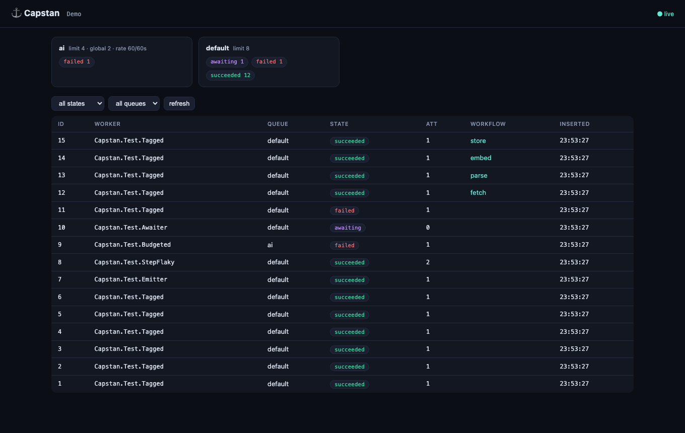
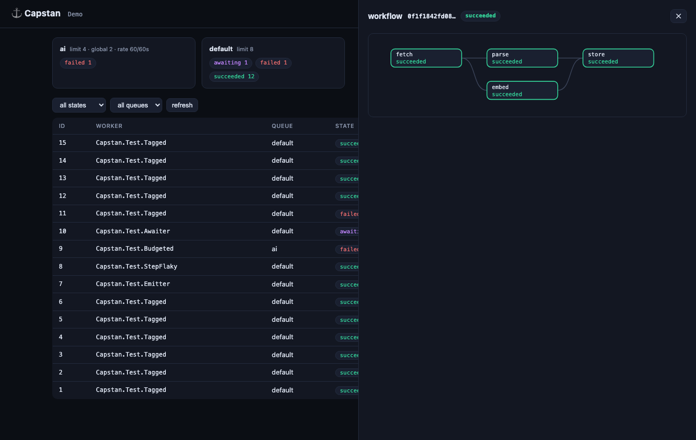

<p align="center"><strong>⚓ Capstan</strong></p>
<p align="center">The durable job engine for the AI age — open, leaderless, Postgres-native.</p>

<p align="center">
  <a href="https://github.com/bariserdem/capstan/actions/workflows/ci.yml"></a>
  <a href="https://hex.pm/packages/capstan"></a>
  <a href="https://hexdocs.pm/capstan"></a>
  <a href="LICENSE"></a>
</p>



Classic job queues retry *whole jobs*. That was fine when jobs sent emails —
it's ruinous when attempt one spent ninety seconds and $0.40 of tokens
before a network blip. Capstan changes the unit of retry: jobs are made of
**memoized steps with cost accounting**, so a retry replays finished work in
microseconds, a **budget cap kills a runaway agent** mid-flight, and the
journal left behind is a debugging asset you can literally re-execute.

Everything here is open, Apache-2.0. **There is no paid tier — the base
thing is the best version.**

```elixir
defmodule MyApp.ResearchAgent do
  use Capstan.Worker, queue: :ai, max_attempts: 10

  @impl Capstan.Worker
  def run(ctx) do
    # Steps run at most once per job — a crash after :summarize never re-buys :transcribe.
    text    = Capstan.step(ctx, :transcribe, fn -> whisper!(ctx.job.input["url"]) end)
    summary = Capstan.step(ctx, :summarize, fn -> llm!(text) end, cost: [usd: 0.02, tokens: 1200])

    # Fan out real jobs across the cluster; park at zero cost until all land.
    checks = Capstan.map_children(ctx, :verify, MyApp.FactCheck,
               Enum.map(summary.claims, &%{"claim" => &1}))

    # Human in the loop: durable wait, instant wake on signal.
    case Capstan.await(ctx, :approval, timeout: 86_400) do
      %{"approved" => true} -> {:ok, summary}
      _ -> {:cancel, :rejected}
    end
  end
end

# A hard spend cap, enforced by the engine at step boundaries:
Capstan.insert(MyApp.Capstan,
  MyApp.ResearchAgent.new(%{"url" => url}, budget: [usd: 1.00], unique: "research:#{url}"))
```

## Why Capstan

- **The journal is the core.** Steps, costs, events, and results are
  first-class columns — so budgets ("kill this agent at $5"), token-true-up
  rate limits, streaming, and replay debugging fall out of the schema
  instead of being bolted on.
- **Leaderless everything.** No peer election exists in the codebase: cron
  dedupes through a unique index, recovery is idempotent row-level work any
  node performs. The "leader stalled, nothing runs" failure class is
  structurally absent.
- **Millisecond dispatch on a polling-floor guarantee.** Adaptive burst
  polling plus an opt-in `pg_notify` accelerator — measured **11ms p50
  insert→result across unconnected processes** — while nothing load-bearing
  touches LISTEN/NOTIFY, so PgBouncer transaction pooling and serverless
  Postgres just work.
- **Leases with fencing, not rescue heuristics.** Crashed workers' jobs are
  reclaimed in seconds; zombie acks are rejected by attempt fencing.
- **Deterministic by design.** Storage behind a behaviour with an in-memory
  reference adapter; the clock injectable everywhere (SQL included). One
  suite runs against both adapters, and time-dependent behavior is tested by
  time travel, never sleeps.

## The workflow DAG view

Workflows, fan-outs, and agent-spawned children render as a live graph —
deep-linkable (`#workflow=<id>`), with the full step journal one click away:



## Feature tour

| | |
|---|---|
| Durable steps + budgets | `step/4` with `cost:`; `budget: [usd:, tokens:]` — retries replay, caps kill |
| Human-in-the-loop | `await/3` parks at zero cost; `signal_job/4` wakes instantly; deadlines |
| Steering & cancellation | `steer/3` injects guidance mid-run; cooperative cancel at step boundaries |
| Dynamic children | `spawn/3`, `await_children/1`, `map_children/5` — replay-safe runtime DAGs |
| Workflows & batches | declared DAGs, transactional release, cascade/ignore policies |
| Event streams | `emit/2` + live subscriptions + offset replay — survives crashes |
| Replay debugging | `Capstan.Replay.dry_run/2` — re-run code against the recorded journal |
| Cluster limits | `global_limit`, sliding-window `rate` (request- or **token**-based with true-up), per-tenant `partition` fairness (exact, skew-proof) |
| Transactional enqueue | `Capstan.Txn.insert/3` in your Postgrex/Ecto transaction; wake-ups deliver exactly on commit |
| Unique jobs | constraint-backed: while-incomplete, windowed, or forever |
| Encrypted inputs | AES-256-GCM at rest; plaintext only in the executing process |
| Runtime CRUD | `Capstan.Queues` / `Capstan.Crons` — change queues and schedules with no deploy |
| Scheduling | `schedule_in`, durable `sleep/3`, leaderless cron with exactly-once slots |
| **Embedded dashboard** | zero dependencies, one child spec — everything in the screenshots above |
| **MCP server** | `mix capstan.mcp` — AI assistants inspect and operate the queue, mutations behind a pluggable authorizer |

## Measured, not claimed

Numbers from this repo's reproducible harnesses on a laptop (Postgres 16):

| What | Result | Harness |
|---|---|---|
| Dispatch, same node | **8.6ms** p50 insert→result | `bench/run.sh` |
| Dispatch, cross-process + `pg_notify` | **11.0ms** p50 / 24.5ms p99 | `bench/run.sh` |
| Throughput (unbatched acks, 3 workers) | ~416 jobs/s end-to-end | `bench/throughput.exs` |
| Chaos soak | 990 jobs · 50 `kill -9` · 2 DB restarts · **13/13 invariants** | `soak/run.sh` → report committed in `soak/REPORT.md` |
| Suites | 81 (memory) + 87 (Postgres), same tests, `--warnings-as-errors` | `mix test` |

The soak found two real concurrency bugs before any user could
([CHANGELOG](CHANGELOG.md), rc.2); the fixes and their race lessons are
codified in the [wire contract](SCHEMA.md).

## Quick start

```elixir
# mix.exs
{:capstan, "~> 1.0.0-rc"}

# once, at deploy time
Capstan.Storage.Postgres.migrate!(db_url)

# application.ex
children = [
  {Capstan,
   name: MyApp.Capstan,
   storage: [adapter: :postgres, url: db_url],
   queues: [
     default: 10,
     ai: [limit: 5, global_limit: 2,
          rate: [allowed: 100_000, period: 60, resource: "anthropic", estimate: 2_000]]
   ],
   crons: [[name: "digest", expr: "0 8 * * 1-5", worker: MyApp.Digest]]},
  {Capstan.Dashboard, capstan: MyApp.Capstan, port: 4004}
]
```

Testing is deterministic — drain synchronously, travel through time:

```elixir
{:ok, job} = Capstan.insert(name, MyApp.Pipeline.new(%{"id" => 1}))
assert %{succeeded: 1} = Capstan.Testing.drain(name, :default)

Capstan.Clock.Sim.advance(clock, 3_600)   # backoff, cron, rate windows, leases…
```

## Polyglot by construction

The Postgres schema **is** the protocol — specified in [SCHEMA.md](SCHEMA.md)
with a dual ETF/JSON value envelope already in place. Python and TypeScript
SDKs are planned as thin contract implementations (not rewrites), certified
by the same soak harness, sharing one database with Elixir workers.

## Docs

[Getting started](guides/getting-started.md) ·
[Durable steps](guides/durable-steps.md) ·
[Building agents](guides/agents.md) ·
[Operations](guides/operations.md) ·
[Testing](guides/testing.md) ·
[Honest comparison](guides/comparison.md) ·
[Architecture](DESIGN.md) ·
[Wire contract](SCHEMA.md)

## Status

**1.0.0-rc.** Feature-complete and chaos-soaked; new — the design is
careful and the suites are strong, but production miles are the one feature
that can't be rushed. The path to 1.0 final (endurance soak, design
partners) is public in [docs/ZERO_TO_ONE.md](docs/ZERO_TO_ONE.md).
Post-1.0: SQLite storage, batched acking, Python/TypeScript SDKs.

## License

Apache-2.0. Contributions welcome — [CONTRIBUTING.md](CONTRIBUTING.md)'s
five rules are the soul of the codebase.
