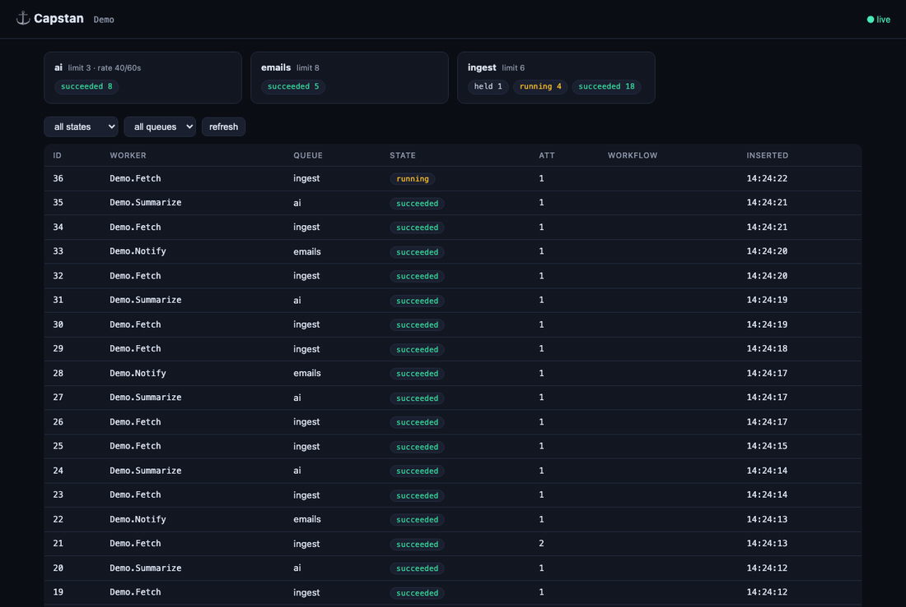
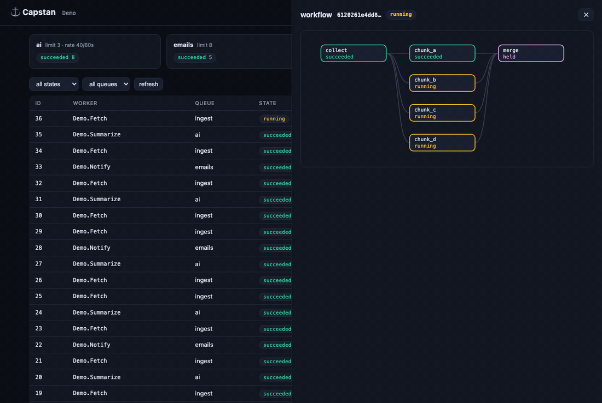

<p align="center"><strong>⚓ Capstan</strong></p>
<p align="center">A durable job engine for Elixir, on Postgres. Jobs are built from memoized steps — retries resume work instead of redoing it.</p>

<p align="center">
  <a href="https://github.com/b-erdem/capstan/actions/workflows/ci.yml"></a>
  <a href="https://hex.pm/packages/capstan"></a>
  <a href="https://hexdocs.pm/capstan"></a>
  <a href="LICENSE"></a>
</p>



Classic job queues retry *whole jobs*. Capstan's unit of durability is the
**step**: each step's result is journaled the moment it completes, so a
retried job replays finished steps from the journal in microseconds and
continues from the first unfinished one. The same journal carries cost
accounting, an event stream, and a record you can re-execute to debug.

Dependencies: Postgrex, Jason, telemetry — no Ecto requirement, no Redis,
no separate service. Apache-2.0.

## Quick start

```elixir
# mix.exs
{:capstan, "~> 1.0.0-rc.5"}
```

```elixir
# config/config.exs — the Ecto/Phoenix convention, keyed by the instance name
config :my_app, MyApp.Capstan,
  queues: [default: 10, mailers: [limit: 20]],
  crons: [[name: "digest", expr: "0 8 * * 1-5", worker: MyApp.Digest]]

# config/runtime.exs — runtime values (the database URL)
config :my_app, MyApp.Capstan,
  storage: [adapter: :postgres, url: System.fetch_env!("DATABASE_URL")]
```

```elixir
# application.ex — otp_app pulls the config above; inline opts still override
children = [
  {Capstan, otp_app: :my_app, name: MyApp.Capstan},
  {Capstan.Dashboard, capstan: MyApp.Capstan, port: 4004}
]

# once, at deploy time (idempotent)
Capstan.Storage.Postgres.migrate!(db_url)
```

Prefer everything inline in the supervision tree? That works too — pass the
same keys to `{Capstan, name: ..., storage: ..., queues: ...}` and skip
`otp_app`.

```elixir
defmodule MyApp.WelcomeEmail do
  use Capstan.Worker, queue: :mailers, max_attempts: 5

  @impl Capstan.Worker
  def run(ctx) do
    MyApp.Mailer.deliver_welcome(ctx.job.input["user_id"])
  end
end

Capstan.insert(MyApp.Capstan, MyApp.WelcomeEmail.new(%{"user_id" => 42}))
```

Testing is deterministic — drain synchronously, travel through time:

```elixir
{:ok, job} = Capstan.insert(name, MyApp.Pipeline.new(%{"id" => 1}))
assert %{succeeded: 1} = Capstan.Testing.drain(name, :default)

Capstan.Clock.Sim.advance(clock, 3_600)   # backoff, cron, rate windows, leases…
```

## Steps, waits, fan-out — one worker

Where Capstan pulls ahead of a classic queue is jobs with expensive parts,
long waits, and moving pieces:

```elixir
defmodule MyApp.ResearchPipeline do
  use Capstan.Worker, queue: :pipelines, max_attempts: 10

  @impl Capstan.Worker
  def run(ctx) do
    # Steps run at most once per job — a crash after :summarize never re-buys :transcribe.
    text    = Capstan.step(ctx, :transcribe, fn -> whisper!(ctx.job.input["url"]) end)
    summary = Capstan.step(ctx, :summarize, fn -> llm!(text) end, cost: [usd: 0.02, tokens: 1200])

    # Fan out real jobs across the cluster; park at zero cost until all land.
    checks = Capstan.map_children(ctx, :verify, MyApp.FactCheck,
               Enum.map(summary.claims, &%{"claim" => &1}))

    # Human in the loop: durable wait, instant wake on signal.
    case Capstan.await(ctx, :approval, timeout: 86_400) do
      %{"approved" => true} -> {:ok, %{summary: summary, checks: checks}}
      _ -> {:cancel, :rejected}
    end
  end
end

# Enforced caps and dedup at insert:
Capstan.insert(MyApp.Capstan,
  MyApp.ResearchPipeline.new(%{"url" => url}, budget: [usd: 1.00], unique: "research:#{url}"))
```

The same engine runs the unglamorous fleet — emails, webhooks, image
processing, nightly crons — and the newer shapes those queues were never
built for: declared workflow DAGs, month-long approval flows parked at zero
cost, and LLM/agent pipelines where each API call is a journaled step with
a price on it.

## Budgets and spend control

LLM-heavy workloads add a failure mode classic queues don't model: cost.
A retry that re-runs completed API calls buys them twice; a usage spike
outruns any dashboard. Capstan enforces spend in the engine, in three
layers:

```elixir
# 1. Per-job hard cap — one runaway job can never exceed its budget.
#    Enforced BEFORE each step against durable spend (model-checked across
#    crash/retry windows — not even kill -9 mid-failure buys an extra step).
MyApp.ResearchPipeline.new(input, budget: [usd: 1.00])

# 2. Fleet-wide cap per window — a resource bucket spans every queue that
#    names it. Units are yours: tokens, or cents for an app-wide $/day cap.
queues: [
  ai: [limit: 20,
       rate: [resource: "anthropic_tokens", allowed: 2_000_000, period: 60, estimate: 3_000]]
]
# When the window is spent, claims stop; work queues instead of billing.

# 3. True-up — the claim debits the estimate; inside the job you correct it
#    with actuals, so the window converges on what the invoice will say.
#    A job debits its own queue's resource:
Capstan.step(ctx, :summarize, fn ->
  %{text: text, usage: usage} = llm!(prompt)
  Capstan.debit(ctx, "anthropic_tokens", usage.total_tokens)
  text
end, cost: [usd: 0.02])
```

Elsewhere, retries multiply spend — each attempt re-buys the work. Here
they don't: finished steps replay from the journal at zero cost, and the
budget check reads *durable* spend, so an attempt can never "forget" what
previous attempts already paid.

## Why it's built this way

- **The journal is the core.** Steps, costs, events, and results are
  first-class columns — so budgets, token-true-up rate limits, streaming,
  and replay debugging fall out of the schema instead of being bolted on.
- **Leaderless everything.** No peer election exists in the codebase: cron
  dedupes through a unique index, recovery is idempotent row-level work any
  node performs. The "leader stalled, nothing runs" failure class is
  structurally absent.
- **Millisecond dispatch on a polling-floor guarantee.** Adaptive burst
  polling plus an opt-in `pg_notify` accelerator — measured **11ms p50
  insert→result across unconnected processes** — while nothing load-bearing
  touches LISTEN/NOTIFY, so PgBouncer transaction pooling and serverless
  Postgres just work.
- **Leases with fencing, not rescue heuristics.** Crashed workers' jobs are
  reclaimed in seconds; zombie acks are rejected by attempt fencing.
- **Deterministic by design.** Storage behind a behaviour with an in-memory
  reference adapter; the clock injectable everywhere (SQL included). One
  suite runs against both adapters, and time-dependent behavior is tested by
  time travel, never sleeps.

## The workflow DAG view

Workflows, fan-outs, and spawned children render as a live graph —
deep-linkable (`#workflow=<id>`), with the full step journal one click away:



## Feature tour

| | |
|---|---|
| Durable steps + budgets | `step/4` with `cost:`; `budget: [usd:, tokens:]` — retries replay, caps kill |
| Human-in-the-loop | `await/3` parks at zero cost; `signal_job/4` wakes instantly; deadlines |
| Steering & cancellation | `steer/3` injects guidance mid-run; cooperative cancel at step boundaries |
| Dynamic children | `spawn/3`, `await_children/1`, `map_children/5` — replay-safe runtime DAGs |
| Workflows & batches | declared DAGs, transactional release, cascade/ignore policies |
| Event streams | `emit/2` + live subscriptions + offset replay — survives crashes |
| Replay debugging | `Capstan.Replay.dry_run/2` — re-run code against the recorded journal |
| Cluster limits | `global_limit`, sliding-window `rate` (request- or **token**-based with true-up), per-tenant `partition` fairness (exact, skew-proof) |
| Transactional enqueue | `Capstan.Txn.insert/3` in your Postgrex/Ecto transaction; wake-ups deliver exactly on commit |
| Unique jobs | constraint-backed: while-incomplete, windowed, or forever |
| Chunk workers | `chunk: [size:, gather_ms:]` — N jobs, one invocation (batch-priced APIs, bulk INSERTs), per-job partial failure |
| Adaptive concurrency | `limit: [min:, max:]` — per-node scaling under load, exactly bounded by cluster limits |
| Encrypted inputs | AES-256-GCM at rest; plaintext only in the executing process |
| Runtime CRUD | `Capstan.Queues` / `Capstan.Crons` — change queues and schedules with no deploy |
| Scheduling | `schedule_in`, durable `sleep/3`, leaderless cron with exactly-once slots |
| Embedded dashboard | zero dependencies, one child spec — everything in the GIFs above |
| MCP server | `mix capstan.mcp` — AI assistants inspect and operate the queue, mutations behind a pluggable authorizer |
| Oban migration | `mix capstan.migrate_oban` — pending jobs move in one command: dry-run analyzer, port verification, idempotent |

## Measured, not claimed

Numbers from this repo's reproducible harnesses on a laptop (Postgres 16):

| What | Result | Harness |
|---|---|---|
| Dispatch, same node | **8.6ms** p50 insert→result | `bench/run.sh` |
| Dispatch, cross-process + `pg_notify` | **11.0ms** p50 / 24.5ms p99 | `bench/run.sh` |
| Throughput (unbatched acks, 3 workers) | ~416 jobs/s end-to-end | `bench/throughput.exs` |
| Endurance soak (7h) | 99,004 jobs · 4,978 `kill -9` · 13 DB restarts — surfaced one real bug (below); **13/13 invariants** on the post-fix revalidation | `soak/run.sh` → reports in `soak/reports/` |
| Model checking | **187,975,659 distinct states, zero violations** (TLC, complete to depth 49) | `verify/spec/` |
| Schedule exploration | READ COMMITTED wake race reproduced + fix proven across 400 schedules | `verify/wake_protocol/` |
| Suites | 119 (memory) + 129 (Postgres), same tests, `--warnings-as-errors` | `mix test` |

Six real bugs were found by these harnesses before any user could: two by
the chaos soak (a READ COMMITTED wake race among them), one by the 7-hour
endurance run (the budget crash window), one by adapter-equivalence
property testing (lost cancel requests), and two by extending the formal
model (retry semantics). The model is validated by *rediscovery*: revert
any fix in it and TLC reproduces the production failure, step for step
([CHANGELOG](CHANGELOG.md), [verify/](verify/README.md)). The race lessons
are codified in the [wire contract](SCHEMA.md).

## Proven on a real app

The first design-partner port replaced Oban in a production-shaped Phoenix
ingestion service (4 workers, webhooks, GDPR deletion flows, hourly cron,
uniqueness everywhere): **222/222 tests green and a live-producer run on the
first attempt, with zero engine changes required**. Dead-node recovery
tightened from a conservative 45-minute rescue plugin to ~2× a 60-second
lease — renewed leases replace guessing.

## Coming from Oban?

Workers port mechanically (`perform/1` → `run/1`), the plugins you delete
are engine config (Pruner → `retention:`, Lifeline → renewed leases, Cron
→ `crons:`), and pending jobs move in one command:

```bash
mix capstan.migrate_oban --url postgres://.../my_app            # dry-run report
mix capstan.migrate_oban --url postgres://.../my_app --execute
```

The [migration guide](guides/migrating-from-oban.md) has the full porting
map, the uniqueness translation, and the archive pattern for historical
rows — with field notes from a real port that went 222/222 on the first
run.

## Polyglot by construction

The Postgres schema **is** the protocol — specified in [SCHEMA.md](SCHEMA.md)
with a dual ETF/JSON value envelope already in place. Python and TypeScript
SDKs are planned as thin contract implementations (not rewrites), certified
by the same soak harness, sharing one database with Elixir workers.

## Docs

[Getting started](guides/getting-started.md) ·
[Migrating from Oban](guides/migrating-from-oban.md) ·
[Durable steps](guides/durable-steps.md) ·
[Building agents](guides/agents.md) ·
[Operations](guides/operations.md) ·
[Testing](guides/testing.md) ·
[Honest comparison](guides/comparison.md) ·
[Formal verification](verify/README.md) ·
[Architecture](DESIGN.md) ·
[Wire contract](SCHEMA.md)

## Status

**1.0.0-rc.** Feature-complete; endurance-soaked, model-checked, and
carrying its first real application — new, honestly: production miles are
the one feature that can't be rushed. Post-1.0: SQLite storage, batched
acking, Python/TypeScript SDKs.

## License

Apache-2.0. Contributions welcome — [CONTRIBUTING.md](CONTRIBUTING.md)'s
five rules are the soul of the codebase.
